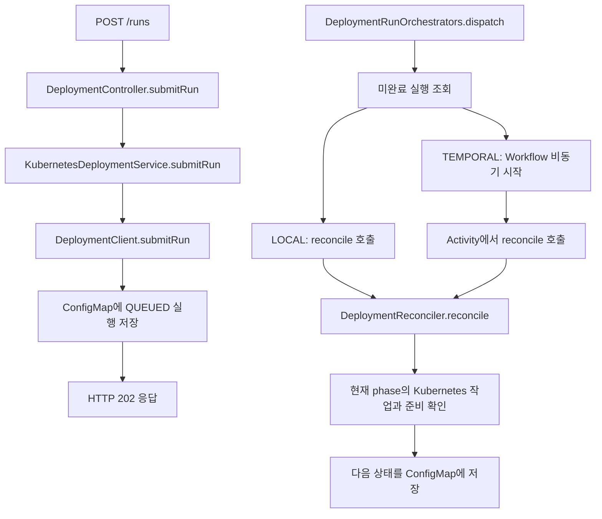

# 배포 코드 읽기

이 코드는 배포 요청을 저장한 뒤, Kubernetes의 현재 상태를 확인하면서 다음 단계로 진행한다.
핵심 함수는 `DeploymentReconciler.reconcile()`이다. 한 번 호출할 때 현재 단계를 처리하고,
Pod나 라우터가 아직 준비되지 않았으면 같은 단계에 머문다. 다음 호출에서 다시 확인한다.

API 호출과 preview 접속 명령은 [운영 및 테스트 절차](DEPLOYMENTS.md)에 있다.
이 문서는 그 요청이 내부에서 어떤 코드로 처리되는지 설명한다.

## 1. 파일을 읽는 순서

| 순서 | 파일 | 먼저 볼 코드 | 역할 |
|---|---|---|---|
| 1 | [DeploymentModels.kt](deployment-library/src/main/kotlin/com/deploy/k8s/DeployDock/deployment/DeploymentModels.kt) | `DeploymentConfiguration`, `DeploymentRun` | 저장할 설정과 실행 상태의 모양을 정의한다. |
| 2 | [DeploymentController.kt](src/main/kotlin/com/deploy/k8s/DeployDock/deployment/DeploymentController.kt) | `submitRun()`, `action()` | HTTP 요청과 JWT 사용자를 Service에 전달한다. |
| 3 | [DeploymentService.kt](src/main/kotlin/com/deploy/k8s/DeployDock/deployment/DeploymentService.kt) | `submitRun()`, `action()` | 서버의 namespace 접근을 검사하고 라이브러리 호출을 Reactor로 감싼다. |
| 4 | [DeploymentExecution.kt](src/main/kotlin/com/deploy/k8s/DeployDock/deployment/DeploymentExecution.kt) | `dispatch()`, `deploy()` | 서버 주기 실행과 Temporal을 공통 실행기에 연결한다. |
| 5 | [KubernetesDeploymentWorkloads.kt](deployment-library/src/main/kotlin/com/deploy/k8s/DeployDock/deployment/KubernetesDeploymentWorkloads.kt) | `createPreview()`, `switchService()`, `setCanaryWeight()` | Fabric8 클라이언트로 실제 Kubernetes 리소스를 읽고 변경한다. |
| 6 | [DeploymentStore.kt](deployment-library/src/main/kotlin/com/deploy/k8s/DeployDock/deployment/DeploymentStore.kt) | `KubernetesDeploymentStore.update()` | 앱별 ConfigMap에 설정·실행·복구 스냅샷을 저장한다. |
| 7 | [DeploymentClient.kt](deployment-library/src/main/kotlin/com/deploy/k8s/DeployDock/deployment/DeploymentClient.kt) | `saveConfiguration()`, `submitRun()`, `action()` | Spring 없이 입력·중복·실행 조건을 검사한다. |
| 8 | [DeploymentReconciler.kt](deployment-library/src/main/kotlin/com/deploy/k8s/DeployDock/deployment/DeploymentReconciler.kt) | `reconcile()`, `advance()` | 현재 단계에 맞는 작업을 선택한다. |
| 9 | [TrafficAdapter.kt](deployment-library/src/main/kotlin/com/deploy/k8s/DeployDock/deployment/TrafficAdapter.kt) | `CanaryTrafficAdapter`, `DeploymentAuthorization` | 환경별 트래픽 제어와 권한 정책 계약이다. |
| 10 | [GatewayApiTrafficAdapter.kt](deployment-gateway-api/src/main/kotlin/com/deploy/k8s/DeployDock/deployment/GatewayApiTrafficAdapter.kt) | `capture()`, `setWeight()`, `isReady()` | 선택형 모듈에서 HTTPRoute를 처리한다. |
| 11 | [BatchExecutionClient.kt](deployment-library/src/main/kotlin/com/deploy/k8s/DeployDock/deployment/BatchExecutionClient.kt) | `submit()`, `reconcile()` | 배포와 독립된 수동 Job 접수·생성·상태 확인이다. |
| 12 | [BatchExecutionController.kt](src/main/kotlin/com/deploy/k8s/DeployDock/deployment/BatchExecutionController.kt) | `submit()`, `history()`, `BatchExecutionScheduler` | 실행 API의 namespace 검사와 주기적 Job 상태 확인이다. |

핵심 모듈은 `deployment-library`이며 Spring·Reactor·Temporal을 참조하지 않는다.
서버를 거치지 않고 `DeploymentClient`와 `DeploymentReconciler`를 직접 사용해도 같은 실행 로직을 거친다.
[독립 호출 예제와 어댑터 계약](deployment-library/README.md)을 참고한다.
`DeploymentBeans`가 서버에서 저장소·권한·어댑터를 연결하며 Gateway 어댑터는 설정으로 켰을 때만 등록한다.

`Service`라는 이름에 주의한다. `KubernetesDeploymentService`는 Spring의 업무 처리 클래스이고,
`KubernetesDeploymentWorkloads` 안의 Kubernetes `Service`는 Pod로 트래픽을 보내는 클러스터 리소스다.

## 2. 데이터가 의미하는 것

| 모델 또는 필드 | 의미 | 예 |
|---|---|---|
| `DeploymentApplication` | 어느 워크로드를 누가 관리하는지 | `team-a`의 `shop-web`, 실행 방식 `TEMPORAL` |
| `DeploymentConfiguration` | 저장 시점에 고정한 배포 설정 | 이미지 `shop:v2`, 전략 `BLUE_GREEN`, revision 2 |
| `DeploymentRun` | 특정 설정을 적용하는 한 번의 실행 | `run-...`, 승인 대기, preview 접속 정보 |
| `DeploymentSnapshot` | 복구에 사용할 실행 전 리소스 정보 | 원본 Deployment, Service selector, HTTPRoute backend, CronJob |
| `DeploymentRecord` | ConfigMap 하나에 들어가는 앱별 데이터 | 앱 정보 + 최신 설정 한 개 + 배포 목록 + 별도 배치 실행 목록 |
| `BatchExecution` | 배포와 무관하게 접수한 수동 Job 한 건 | 실제 템플릿 이미지, Job UID, Pod 성공/실패 수, 완료 상태 |
| `DeploymentRun.configuration` | 해당 실행을 시작할 때 고정한 설정 | 최신 저장 설정이 바뀌어도 실행·승인·롤백은 이 설정 사용 |
| `status` | 사용자가 보는 실행 상태 | `RUNNING`, `AWAITING_APPROVAL`, `SUCCEEDED` |
| `phase` | 다음 호출에서 처리할 내부 단계 | `WAIT_READY`, `SWITCH_WAIT`, `RESTORE` |
| `action` | 접수됐지만 실행기가 아직 처리하지 않은 요청 | `ADVANCE`, `PROMOTE`, `ABORT` |

예를 들어 `status=PROMOTING`, `phase=SOURCE_READY`는 "승격 중이며 원본 Deployment가
새 이미지로 준비되기를 기다리는 중"이라는 뜻이다. Service를 수정했다는 사실만으로
`SUCCEEDED`를 기록하지 않기 위해 상태와 단계를 구분한다.

`requestId`는 호출자가 정하는 중복 방지 키다. `run.id`는 서버가 만든 실행 식별자이고,
`executionId`는 `deploydock-<run.id>` 형식이며 Temporal에서는 Workflow ID로 사용한다.
승인 요청의 중복 방지 기록은 해당 실행의 `actionRequests`에 따로 저장한다.

## 3. 요청 접수와 실제 실행

`submitRun()`은 먼저 같은 `requestId`가 있는지 찾는다. 같은 설정이면 기존 실행을 반환하고,
다른 설정이면 충돌로 거부한다. 새 요청이면 활성 실행 유무, 최신 설정 ID 여부, 실행 방식,
실제 배포 권한을 확인한 다음 당시 설정과 함께 `QUEUED` 실행을 저장한다. Kubernetes 배포 완료를 기다리지는
않지만 권한 확인과 저장 요청이 끝나야 응답한다.

`dispatch()`는 기본 5초 간격으로 저장소를 읽는다. `LOCAL`은 재조정 함수를 직접 호출하고,
`TEMPORAL`은 `WorkflowClient.start()`로 Workflow를 비동기 시작한다.
이미 같은 Workflow가 실행 중이면 중복 시작 예외를 받아 넘어간다.

`DeploymentWorkflowImpl.deploy()`는 Activity를 호출하고, 아직 종료 상태가 아니면 5초 후
다시 호출한다. 500회 반복 후에는 `continueAsNew()`로 실행을 이어간다. 현재 배포 단계는
ConfigMap에서 읽으므로 Workflow에는 `applicationId`와 `runId`만 전달한다.

Temporal은 호출 순서·대기·Activity 재시도를 담당한다. Deployment 생성, selector 변경,
준비 상태 판단은 공통 실행기가 담당한다. `deploymentDataConverter()`는 Kotlin과 날짜를
처리하는 Jackson 변환기를 등록한다. Temporal이 꺼져 있으면 `requireAvailable()`에서
요청을 거부하며 로컬 실행으로 자동 변경하지 않는다.

## 4. 블루그린에서 원본 이름을 유지하는 방법

예를 들어 기존 `shop-web` Deployment가 `v1`을 실행하고 있고 `v2`를 배포한다고 하자.
새 Deployment 이름은 `candidateName()`이 실행 ID로 만들고 preview Service는 그 이름에
`-preview`를 붙인다. 재시도해도 이름이 같아서 기존 생성물을 확인할 수 있다.

| 단계 | 코드가 하는 일 | 운영 요청을 받는 Pod |
|---|---|---|
| `PREPARE` | `snapshot()`으로 원본 상태를 읽고 저장한다. | 원본 `v1` |
| `APPLY` | `createPreview()`로 신규 Deployment와 preview Service를 만든다. | 원본 `v1` |
| `WAIT_READY` | `previewReady()`로 신규 버전의 준비 상태를 확인한다. | 원본 `v1` |
| `APPROVAL` | 테스트와 `PROMOTE` 요청을 기다린다. | 원본 `v1` |
| `SWITCH` | `switchService()`로 운영 Service의 selector를 신규 Pod 쪽으로 바꾼다. | EndpointSlice 반영에 따라 신규 `v2`로 이동 |
| `SWITCH_WAIT` | 운영 Service의 준비된 endpoint가 신규 Deployment의 Pod를 가리키는지 확인한다. | 신규 `v2` |
| `UPDATE_SOURCE` | `rolling()`으로 원본 Deployment의 이미지를 `v2`로 갱신한다. | 신규 `v2` |
| `SOURCE_READY` | 원본의 새 Pod가 준비되면 Service selector를 원래 값으로 되돌린다. | EndpointSlice 반영에 따라 원본의 `v2`로 이동 |
| `SOURCE_TRAFFIC` | 원본 준비 및 endpoint를 확인하고 `retirePreview()`로 신규 Deployment를 0개로 줄인다. | 원본의 `v2` |

마지막 단계가 성공하면 `SUCCEEDED`다. 원본 Deployment를 삭제하거나 이름을 바꾸지 않으므로
기존 리소스 이름을 사용하는 운영 작업을 유지할 수 있다. preview Deployment와 Service는
롤백에 재사용하기 위해 남긴다.

`createPreview()`는 원본 Pod 설정을 복제하되, 원본 Deployment와 운영 Service가 공유하는
label 값 하나를 실행 ID로 바꾼다. 신규 Deployment의 selector와 preview Service는
`deploydock.io/run`으로 신규 Pod만 선택한다. 같은 네임스페이스의 다른 Service도 신규
label을 선택할 수 있으면 생성 전에 거부한다. label에 의존하는 NetworkPolicy 등은 별도 확인이 필요하다.

`ready()`는 관측 generation이 최신인지, 전체 replica가 updated/available 상태인지 확인한다.
`previewReady()`는 여기에 이미지·replica 수·실행 소유권·EndpointSlice 검사를 더한다.
EndpointSlice 대상은 Pod 이름의 Deployment 접두사로 확인한다. 이 검사는 실제 HTTP 응답이나
업무 기능 검증이 아니므로, 승인 전에 preview로 직접 테스트해야 한다.

## 5. 카나리에서 추가되는 코드

카나리도 신규 Pod와 preview를 먼저 만들고 `APPROVAL`에서 기다린다.
`DeploymentConfiguration.usesWeightedTraffic()`은 명시적인 어댑터 선택 또는 기존 `canaryRoute`
설정 여부로 트래픽 제어 사용을 결정한다. 등록된 어댑터 목록만 보고 자동 선택하지 않는다.
선택하지 않았다면 결과는 `PREVIEW_ONLY`이며 preview 테스트 후 바로 `PROMOTE`한다.
이 경우 `ADVANCE`는 거부하고 snapshot·권한 검사·승격·복구에서 트래픽 어댑터를 호출하지 않는다.
운영 Service selector 전환과 원본 Deployment 복귀는 블루그린과 같다. 운영 요청 비율을 나누지는 않는다.

어댑터를 명시하면 `WEIGHTED`가 된다. `DeploymentClient.action()`이 `ADVANCE`를 저장하면 다음 `advance()` 호출이
`step`을 올리고 `ROUTE` 단계로 이동한다.

`KubernetesDeploymentWorkloads`는 HTTPRoute를 직접 다루지 않고 등록된 어댑터에 위임한다.
명시적으로 선택한 어댑터가 없으면 가중치 카나리 설정을 거부하며 preview-only로 자동 변경하지 않는다.
다음은 선택형 Gateway 어댑터의 동작이다. `canarySteps=[10, 50]`인 경우 첫 단계에서 `setCanaryWeight()`는 운영 Service backend에
90, preview backend에 10을 넣는다. 다음 단계는 50과 50이다. `routeReady()`가 해당
parent의 최신 generation에 대한 `Accepted`와 `ResolvedRefs`를 확인해야 다시 승인 대기로 돌아간다.

이는 HTTPRoute를 처리하는 Gateway의 동작 확인이며 실제 요청 분포를 측정한 결과는 아니다.
지표 분석과 다음 단계 진행 판단은 운영자가 한다. 아직 모든 단계를 거치지 않았다면
`action()`이 `PROMOTE`를 거부한다.

최종 승격 시 `SWITCH`에서 운영 Service도 신규 Pod를 선택하게 만든다. `SWITCH_WAIT`에서
HTTPRoute backend를 원래 운영 Service 하나로 되돌리고 반영을 기다린다. 이후에는
블루그린과 같은 원본 Deployment 갱신·복귀 과정을 진행한다.

## 6. 실패·중단·롤백

`ABORT`는 진행 중 실행을 `ABORTING / RESTORE`로 옮긴다. 마지막 실행이 성공했고 다른
활성 실행이 없을 때만 `ROLLBACK`을 받을 수 있다. 블루그린·카나리의 성공 후 롤백은
`ROLLBACK_PREVIEW`에서 preview를 다시 가동해 트래픽을 받은 뒤 원본을 복구한다.
일반 롤링과 배치는 바로 `RESTORE`로 들어간다.

| 코드 또는 값 | 의미 |
|---|---|
| `restoreRolling()` | 원본 Deployment의 지정 컨테이너 이미지와 replica 수를 스냅샷 값으로 복원한다. |
| `switchService(..., restore=true)` | 운영 Service의 selector를 원래 값으로 복원한다. |
| `setCanaryWeight(..., null)` | 어댑터에 원래 트래픽 설정 복원을 요청한다. Gateway 구현은 HTTPRoute backend를 복원한다. |
| `RESTORE_WAIT` | 원본 준비와 필요한 Service/Route 반영을 확인한 뒤 preview를 0개로 줄인다. |
| `error` | 원래 배포 실패 이유다. 복구가 끝나도 실패 이력으로 남는다. |
| `recoveryError` | 복구 자체가 막힌 이유다. `ABORTING` 상태에서 재시도하며 복구 완료 시 지운다. |

`reconcile()` 내부 작업이 실패했을 때 스냅샷이 없으면 바로 `FAILED`가 된다.
스냅샷이 있으면 복구 단계로 이동한다. 복구 완료 후 사용자 중단은 `ABORTED`, 배포 실패는
`FAILED`, 성공 후 요청한 롤백은 `ROLLED_BACK`으로 기록한다.
저장소 읽기·잠금·기록 자체의 예외는 재조정 함수 밖으로 전달되어 dispatcher 또는 Temporal이 재시도한다.

스냅샷 전체를 통째로 덮어쓰는 방식은 아니다. 복구 대상 필드만 변경하며 UID, 이미지,
selector, backend 등의 충돌 검사를 둔다. 그 밖의 모든 외부 변경을 감지하는 범용 동기화
기능은 아니므로 HPA/GitOps와 공동 소유하는 경우는 별도 설계가 필요하다.

## 7. 저장과 중복 방지

`KubernetesDeploymentStore.update()`는 ConfigMap을 읽고 만료 시각이 남은 잠금이 있는지
확인한다. 잠금 annotation을 `resourceVersion` 조건으로 기록한 뒤 전달받은 작업을 실행한다.
마지막에는 갱신된 `DeploymentRecord`를 `data.record` JSON에 저장하며 잠금을 제거한다.
정상 완료 전에 프로세스가 종료되면 잠금 만료 후 다음 실행이 저장된 단계부터 재개한다.

중복 방지는 세 곳에 있다. `submitRun()`은 앱별 실행 요청 ID, `action()`은 실행별 승인 요청 ID,
`createPreview()`는 실행 ID에서 만든 리소스 이름을 사용한다. 같은 요청의 재전송과
Kubernetes 적용 후 상태 저장 전에 중단된 경우를 각각 처리하기 위한 장치다.

ConfigMap 저장과 워크로드 변경은 하나의 트랜잭션이 아니다. 이미 반영된 변경을 다시 확인하는
방식으로 복구하며, 임의의 장애에서도 정확히 한 번만 실행된다고 보장하지 않는다.
잠금 만료는 300초이고 자동 갱신은 없다. 앱별 저장량 제한은 800,000바이트이며
무제한 이력 보관이나 네트워크 분할 상황의 HA를 검증한 구성은 아니다.

## 8. 배치와 테스트 연결

배치는 `PREPARE`에서 대상 CronJob을 스냅샷으로 저장하고, `APPLY`에서 `updateBatch()`가
각 `jobTemplate.spec.template.spec`의 지정 컨테이너 이미지를 순차 변경한다.
`GROUPED`는 2~10개, `INDIVIDUAL`은 하나다. 중간 실패 시 같은 함수를 `restore=true`로 호출해
이전 이미지로 복원한다. 성공은 템플릿 반영 완료를 의미하며 배치 Job의 실행 성공을 의미하지 않는다.

수동 실행은 `BatchExecutionClient`가 담당한다. `DeploymentRun`을 만들거나 재사용하지 않는다.

1. `submit()`은 batch 앱·대상·권한을 검사하고 현재 CronJob의 JobSpec을 읽는다. 최신 저장 설정의 이미지를 복사하지 않는다.
2. requestId에서 안정적인 Job 이름을 만들고 `desiredJob`과 함께 QUEUED 이력을 저장한다. 접수 단계에서는 Job을 만들지 않는다.
3. `reconcile()`은 요청자의 권한을 다시 검사한 뒤 같은 이름의 Job을 조회한다. 없으면 저장된 JobSpec으로 생성한다.
4. 생성 후 이력 저장 전에 재시작해도 실행 label·앱 annotation·requestId로 이미 생성된 Job을 확인한다. UID를 확인한 뒤에는 UID도 일치해야 한다.
5. Job 상태의 Complete/Failed condition으로 성공·실패를 확정한다. Pod 실패 횟수만으로 종료하지 않는다.
6. 종료 상태는 보존한다. 아직 미완료인 기존 UID의 Job이 사라지면 MISSING으로 종료하고 새 Job을 만들지 않는다.

`desiredJob`은 컨테이너 설정을 포함하므로 submit/history API에서는 제거한다. 저장소 자체 접근 권한은 별도 보호해야 한다.
Job 생성과 이력 저장은 원자적이지 않다. 생성 직후 이력 저장 전에 Job까지 삭제되는 장애에서는
존재 여부만으로 과거 실행을 입증할 수 없으므로 exactly-once 보장은 하지 않는다.
스케줄로 생성된 Job은 조회·수집하지 않는다. 동시 수동 실행은 허용하며 기존 CronJob 스케줄도 바꾸지 않는다.

| 확인하려는 동작 | 읽을 테스트 |
|---|---|
| 서버 없는 실행과 사용자 정의 트래픽 어댑터 | [StandaloneDeploymentTests.kt](deployment-library/src/test/kotlin/com/deploy/k8s/DeployDock/deployment/StandaloneDeploymentTests.kt) |
| 배포/수동 실행 분리, 템플릿 고정, 중복 요청, 상태 확인, 유실, 재시작·권한 | [BatchExecutionTests.kt](deployment-library/src/test/kotlin/com/deploy/k8s/DeployDock/deployment/BatchExecutionTests.kt) |
| preview 격리, 승인 전 전환 거부, 원본 복귀, 롤백 | [DeploymentExecutionTests.kt](src/test/kotlin/com/deploy/k8s/DeployDock/deployment/DeploymentExecutionTests.kt)의 `blue green isolates preview...` |
| 카나리 단계 승인·중복 방지·Route 반영 대기 | 같은 파일의 `canary waits for each approval...`, `canary promotion restores...` |
| 원본 갱신 중 중단, 외부 Service 변경 충돌 | 같은 파일의 `abort while original is updating...`, `external Service selector change...` |
| 재시작·잠금·권한·배치 부분 실패 | 같은 파일의 `store recreation...`, `live record lock...`, `namespace visibility...`, `grouped CronJob update...` |
| Temporal payload와 Workflow | 같은 파일의 `Temporal converter...`, `Temporal workflow polls activities...` |
| 실제 Pod의 HTTP 버전·승격·롤백 | [DeploymentClusterTests.kt](src/test/kotlin/com/deploy/k8s/DeployDock/deployment/DeploymentClusterTests.kt) |

일반 테스트는 mock API 서버의 상태를 테스트 코드에서 갱신하므로 실제 Kubernetes controller나
Gateway 데이터 경로까지 검증하지 않는다. 실 클러스터 테스트는 별도 환경변수가 있어야 실행된다.
배치 수동 실행 분리 후 자동 테스트 47개 통과, 실 클러스터 테스트 1개 미실행을 확인했다.
모든 Kubernetes 환경에서 실행을 검증했다는 의미는 아니다.

## 9. 웹 콘솔

웹 화면은 [deployments.html](src/main/resources/static/deployments.html), 배치 화면은
[batch.html](src/main/resources/static/batch.html), 공통 동작은
[deployments.js](src/main/resources/static/js/deployments.js)에 있다. 기존 인증 토큰을 사용하고
별도 프론트엔드 프레임워크 없이 같은 서버의 배포 API를 호출한다.

- `initialize()`는 앱·접근 가능한 namespace·서버 capability를 읽고 페이지 종류에 맞는 앱만 표시한다. 등록 종류도 해당 페이지로 고정한다.
- `loadDetail()`은 선택한 앱의 설정과 실행을 조회하며, 앱 변경 후 도착한 이전 응답은 버린다.
- 실행 현황은 4초마다 갱신한다. `renderActions()`가 상태·가중치 단계·최신 실행 여부에 따라 버튼을 구성한다.
- 상태 조회 실패 시 `fresh=false`로 변경 요청을 막는다. 최종 권한·상태 검사는 서버가 수행한다.
- 실행·승인·중단·롤백은 확인 대화상자를 거친다. `postIdempotent()`는 응답 유실 시 재시도할 requestId를 sessionStorage에 유지하고 성공 응답 후 제거한다.
- preview는 서버가 반환한 Service·포트로 명령을 구성한다. UI는 port-forward를 실행하지 않는다. 종료된 실행에서는 preview 접속 버튼을 숨긴다.
- DOM에는 서버 문자열을 `textContent`로 넣는다. 스냅샷은 기존 API에서 제외하고 화면에도 표시하지 않는다.
- 배치의 `loadExecutions()`는 수동 실행과 실제 CronJob 이미지를 따로 읽고 `executionFresh`로 실행 버튼을 제어한다. 이 조회 실패가 배포 버튼까지 잠그지 않는다.
- 배치 배포 버튼은 `/runs`, 수동 실행 버튼은 `/executions`를 호출한다. 각 API가 별도의 이력 목록에 저장한다.

[브라우저 테스트](dev/ui/check.mjs)는 별도 개발용 모의 API를 사용한다.
제품에 데모 서버를 포함하거나 클러스터 실패 시 모의 데이터로 자동 대체하지 않는다.
